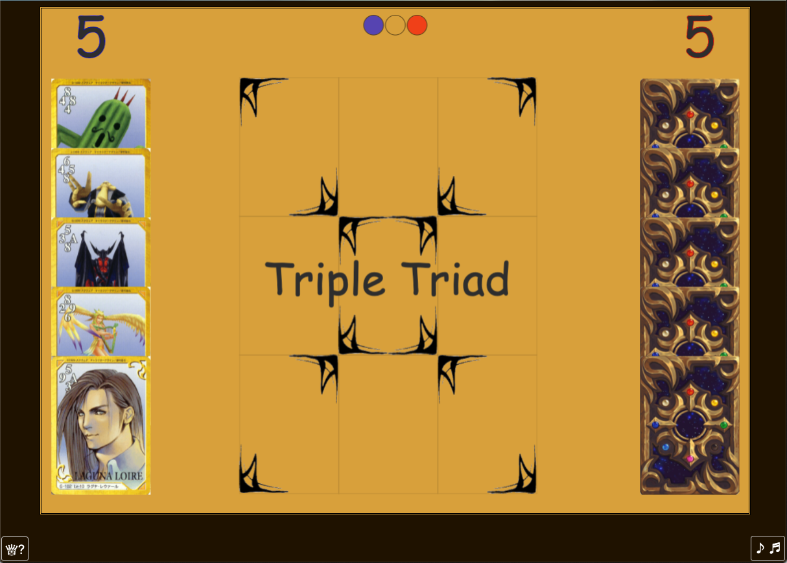
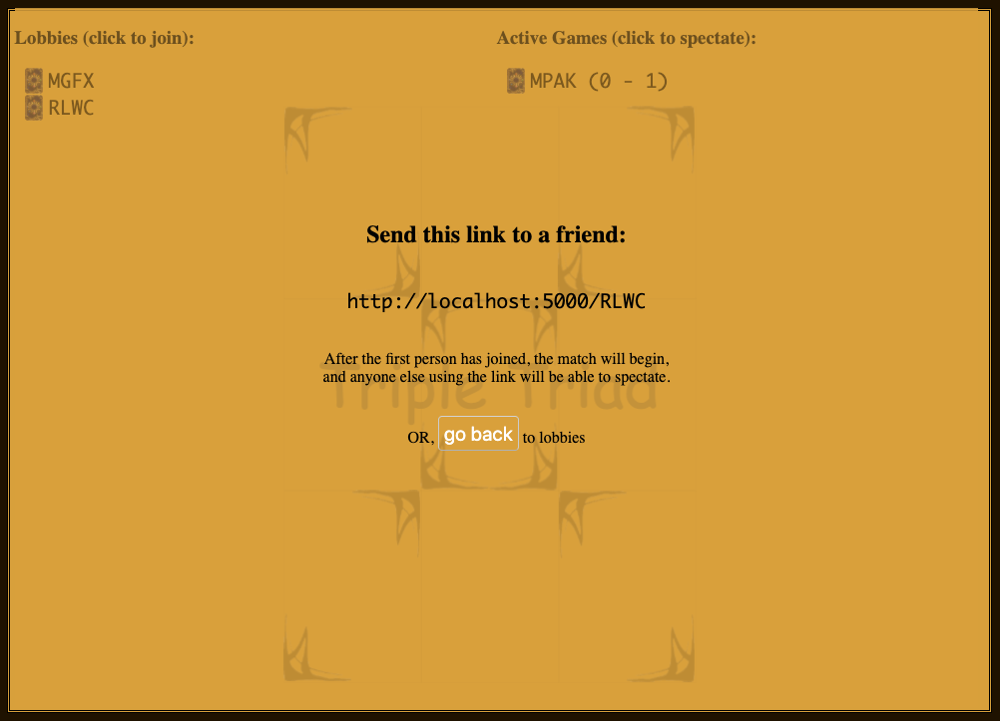

# Triple Triad

Based on a game that once existed in our universe. No ads, no cost, no third-party logins. Just games.

Built with Node.js, Socket.io, and FabricJS.

## Stats and Performance

Client initial load weighs in at < 650KB, and utilizes heavy caching for all resources, so that subsequent views are < 10KB and do not require additional static assets.
Node server runs empty at < 20MB of RAM, with 11 threads.

- Each subsequent/simultaneous match (mostly because of the running game log) adds < 2MB of memory usage, and is mostly reclaimed when the connection ends
- Running game logic for three fully automated bot matches does not spike above 3% CPU utilization on a 2.2 GHz core i7 processor (thanks, Socket.io!)
- Extrapolated theory: 100 simultaneous human matches can run with minimal disruption to the event loop (TODO: Test this)

## How to play

[Short Rule Summary](http://www.vyseri.com/images/tripletriad2.png)

## Copyright

The game, its rules, characters, and artwork are all copyrighted by Square Enix. The game was designed by Hiroyuki Ito and released as a mini-game-plus-side-quest in Final Fantasy VIII in 1999. The card images used in this adaptation originate from the Bandai CCG released the same year, unfortunately for many, only in Japan. The music is an adaptation of "Shuffle or Boogie", by [Simple Music](https://soundcloud.com/simple-music-4/final-fantasy-8-triple-triad-remix). The card back design was created by [Karen McCarthy](https://www.artstation.com/artwork/8YZbq) for another fan-made implementation of this game. Slimmed-down how-to-play content taken from [finalfantasy.fandom.com](https://finalfantasy.fandom.com/wiki/Triple_Triad_(Final_Fantasy_VIII)).

## Changelog:

Version 0.1.4 - RELEASE PENDING

- Improved AI

Version 0.1.3 - 2021-07-27

- Display match ID for in-progress matches
- Add bot vs. bot demo spectate functionality
- If a round stalls twice in a row, re-deal
- Allow spectators to request a rematch for bot demo matches
- Bugfix: Broken how to play close button
- Bugfix: Broken PVP matches after first turn, due to null-checking error for text rendering

Version 0.1.2 - 2020-10-13

- Analytics for completed rounds and matches
- Add HTML metadata
- Adjust tiebreaker power hand to have one weak card, to cut down on gridlocked ties
- Allow players to choose bot difficulty
- Improve initial card placement logic to potentially protect more than one side
- Allow matches against the bot to be easily spectated, and note which player is the bot, as well as the difficulty
- Add click-to-copy functionality to lobby text
- Add close button & close-on-escape functionality to pop-ups
- Clean up & reduce size of corner background image
- Reduce size of card back & favicon

Version 0.1.1 - 2020-06-16

- AI improved to always make an immediately beneficial move. Overlapping attack/defense positions are prioritized above all else.

Version 0.1.0 - 2020-05-23 (initial functionality)

- Socket.io implementation for game server, allowing multiple simultaneous matches
- Allow users to half-start a game (lobby), then send a code/URL to have their friend join them, jackbox-style
  - After the second player has joined, anyone else will be a spectator
  - Allow spectators to connect to matches in progress (replay from game log)
  - List matches in progress on home screen
  - Play against bot opponent (basic intelligence)
- Immediate rematch option given to both players upon match completion, with running score tracked, if yes
- Drag'n'drop method of playing cards (placement limited to empty board spaces)
- Server-side validation of all events and game logic, to limit hacking
- Round ties broken by sudden death rematches where each player is dealt the cards they currently have control of
- Opponent cards played move onto board and utilize a flip animation (flipped cards also animate)
- Opponent cards displayed monochrome
- HTTP resource compression & caching for a fast experience, while reducing server-side load
- Board completely drawn by repeating and rotating a single corner art image
- Only active player can play cards
- Server-side validation of cards & card placement, to keep things from being too easy for hackers
- Sound effects for playing and flipping cards, and winning and losing the match
- Shuffle or Boogie music (remix by Simple Music), with subtle playing indication (notes bounce mostly in time to the music)

Work-in-Progress Corner

#### TODO List:

- TODO: Analytics for started and abandoned matches
- TODO: Add puh-ting and rrrgh sounds for winning/losing round
- Gracefully handle double-clicking of rematch button
- HALF DONE: Resize all of the elements in the canvas on page resize (especially for orientation changes on phones) I think we still have to take zoom into better account, and everything will line up
- HALF DONE: Advanced AI logic, based on move and card analysis
- Add keyboard/controller support
- Add "hint", for easy mode, that runs the AI function to determine the best move, and highlights the suggested card and location to play it
- Figure out why favicon is requested for each card move (and even dragging & dropping the rematch billboard)
- Add all extended game rule options (Open, Chain, Plus)
- Add minimal stats to main lobby (number of players/matches/final score)
- Perfectly centered game board and title positioning
- Add board background art
- Add effects for clicking rematch buttons, with indicator of if opponent wants a rematch
- Add hover effect outline for target location when dragging card
- Stress tester script, to see how many active games can run at a time, and limit games to that upper bound, to ensure a minimum performance level (https://stackoverflow.com/a/16426868/5334305)

#### Idea Stack:

- Allow users to choose names (maybe from a selection of FF VIII characters, to avoid vulgarity)
- Add 30-second countdown timer per turn + autoplay functionality (initial logic for AI bots, just play the first card found that can capture an opponent's card, or the most defensive card available)
- Allow page refresh without quitting match
- Add fun Final Fantasy VIII facts to push to clients while waiting for a game
- Track stats (plays/captures/losses per card and game mode)?
- Permanently store game results (which would enable saved replays)
- Ability to replay a match from a game log
- Dynamically create all card content (power numbers, name, border)
- Add support and options for Final Fantasy XIV cards and modes

